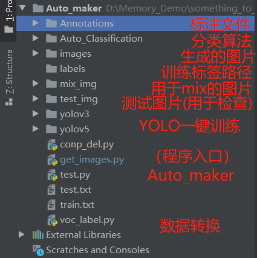
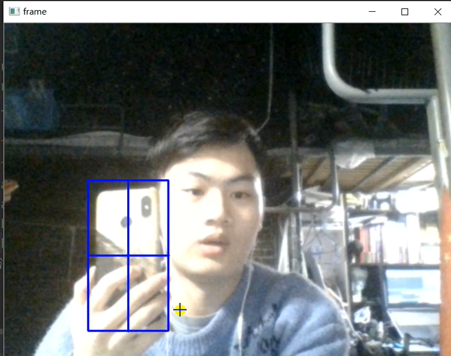
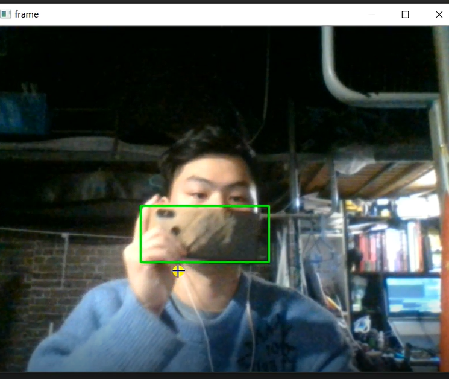
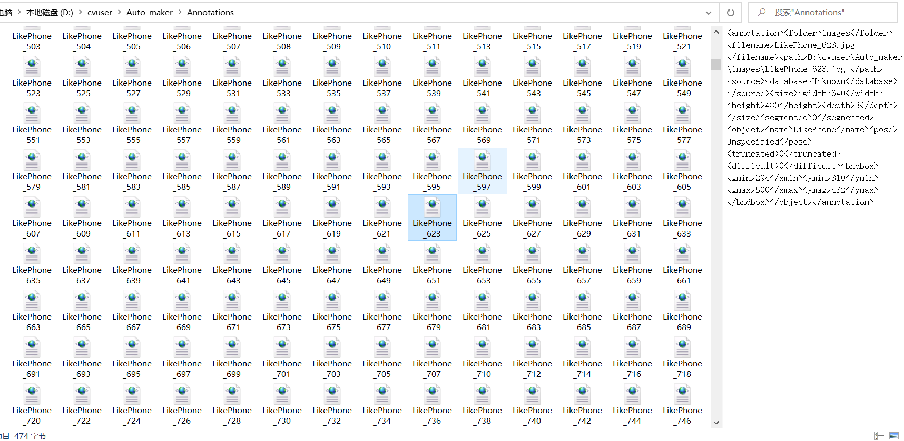
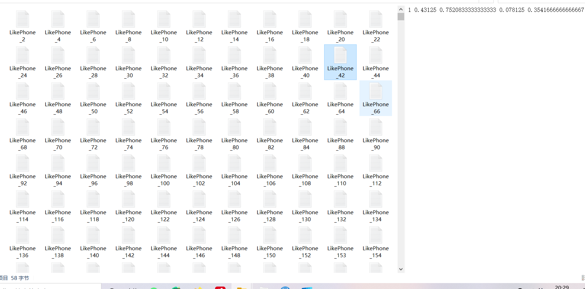
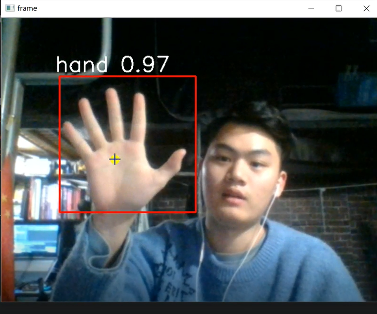
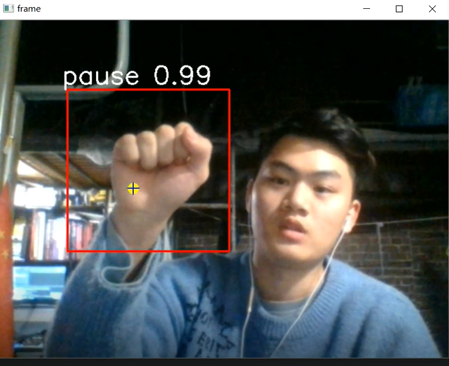

## 项目结构与使用教程


1分钟视频教程：https://mp.weixin.qq.com/s/uhG69C9r2Mt74uerWHF7Xg

更多视频于我的个人公众号(上方链接)~

### 目标检测模式



在我们运行Auto_maker 前，需要安装opencv的库：opencv-contrib-python 库

pip install opencv-contrib-python

**然后运行 get_images.py 就能看到实时图像，再按下"s"键就可以用鼠标绘制目标框，绘制完后回车一下~**

**然后按下“b”键就会看到控制台输出开始保存的提示~**


```python
python get_images.py --mix mix_img/  # 使用mix_up 模式一或多类别标注
python get_images.py  # 使用mix_up 模式一或多类别标注
或者直接右键运行get_images.py 修改argparse 中相关参数为True False
```


然后我们可以左右上下地平移物体，如果内外前后地移动了物体后，追踪框若是发生了偏移，那么就请再按一下“s”重新标注一下~会继续保存图片到images文件夹中，同时也会生成xml到Annotations文件夹中。

就这样，大家不断地平移，切换场景，并且打开mix_up模式，会获得更多，更丰富的图片，这样对我们训练的模型也会更准确和更泛化。

尤其是目标检测中的多尺度问题，需要我们丰富数据及其标注框在图片中的相对大小来解决，我在mix_up 的同时使用了随机等比例缩放，获得更多样式~。

像这样，tracker可以切换成：csrt， kcf，boosting等方式，这是opencv中的追踪算法，csrt是较准的，同时你也可以使用deepsort 进行跟踪，或者使用自己训练好的一个模型，进行其他大量数据的预训练。




 																	数据标注部分




​																				自动标注过程


​																							数据效果图	



​																				标注文件集



### 训练出来的目标检测模型演示

模型已放在github上，轻量级模型，这两天会更新更高精度模型~


### 训练出来的分类模型演示【固定框检测模式】

模型已放在github上，轻量级模型，这两天会更新更高精度模型~






**作者 ：cv调包侠  本科大三 深度学习算法攻城狮实习僧 上海第二工业大学**